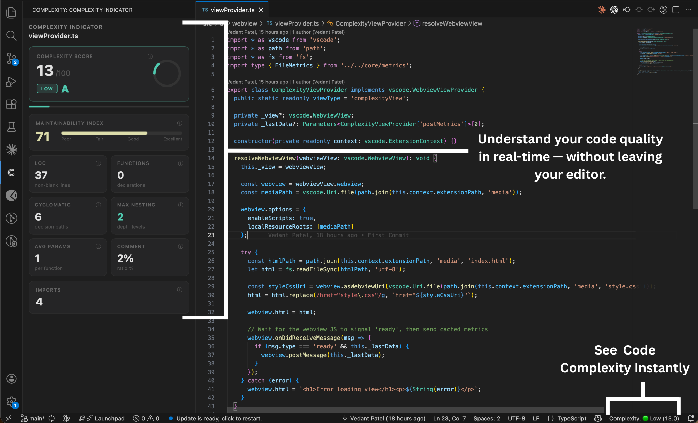

# Complexity Indicator

<p align="left">
  
</p>

A VS Code extension that analyses the complexity of your active file in real time and displays a rich metrics dashboard in the sidebar — works with any language.

---



---

## Features

- **Live updates** — metrics refresh as you type, save, or switch files
- **Sidebar panel** — dedicated view accessible from the activity bar
- **Status bar badge** — shows the complexity label (Low / Medium / High / Very High / Critical) at a glance
- **Info tooltips** — click the ⓘ icon on any metric card to learn what it measures and what the healthy thresholds are
- **Multi-language support** — works with any language (TypeScript, JavaScript, Python, Go, Rust, and more)
- **9 metrics at a glance** — Complexity Score, Maintainability Index, LOC, Function Count, Cyclomatic Complexity, Max Nesting Depth, Average Parameters, Comment Ratio, and Import Count

---

## Metrics Explained

### Complexity Score `0 – 100`
A single weighted score that combines all signals below. Lower is better. Aim for ≤ 40.

| Weight | Signal |
|--------|--------|
| 35% | Cyclomatic Complexity |
| 25% | Max Nesting Depth |
| 20% | Lines of Code |
| 12% | Average Parameters |
| 8% | Function Count |

**Grades:**

| Score | Grade | Label |
|-------|-------|-------|
| 0 – 20 | A | Low |
| 21 – 40 | B | Medium |
| 41 – 60 | C | High |
| 61 – 80 | D | Very High |
| 81 – 100 | F | Critical |

---

### Maintainability Index `0 – 100`
Based on the **Microsoft Maintainability Index** formula, normalised to a 0 – 100 scale. Higher is better.

```
MI = 171 − 0.23 × CC − 16.2 × ln(LOC) + 50 × √(2.46 × commentRatio)
Normalised = MAX(0, MI × 100 / 171)
```

| Range | Rating |
|-------|--------|
| ≥ 85 | Excellent |
| ≥ 70 | Good |
| ≥ 50 | Fair |
| < 50 | Poor — consider refactoring |

---

### Lines of Code (LOC)
Non-blank, non-comment lines — only the lines that actually execute. Block comments (`/* */`) and line comments (`//`) are excluded.

> Rule of thumb: keep files under **300 LOC** for readability.

---

### Function Count
Total number of function or method declarations detected in the file.

> Files with **> 15 functions** often benefit from being split into smaller modules.

---

### Cyclomatic Complexity
Counts the number of independent execution paths through the code (McCabe, 1976). Starts at 1 and increments for every decision point:

`if` · `else if` · `for` · `while` · `do` · `catch` · `case` · `&&` · `||` · `?.` · `??` · ternary `?`

| Value | Meaning |
|-------|---------|
| ≤ 10 | Simple, easy to test |
| 11 – 20 | Moderate complexity |
| > 20 | High risk — hard to test and maintain |

---

### Max Nesting Depth
The deepest level of nested control flow structures (`if`, `for`, `while`, `try`, etc.).

| Depth | Status |
|-------|--------|
| ≤ 2 | Good (shown in green) |
| 3 – 4 | Warning (shown in orange) |
| ≥ 5 | Danger (shown in red) |

> Google's engineering guidelines recommend keeping nesting at **≤ 3 levels**. Use early returns and guard clauses to flatten nesting.

---

### Average Parameters
The average number of parameters across all functions in the file.

> Functions with **> 4 parameters** are harder to call, read, and test. Consider grouping related parameters into a class or object.

---

### Comment Ratio
The percentage of total lines that are comments.

> A healthy ratio is **15 – 30%**. Too low may mean under-documented code; too high may indicate outdated or noisy comments.

---

### Import Count
The total number of `import` statements in the file.

> A high import count can indicate tight coupling or a file doing too much. Consider extracting responsibilities into dedicated helpers.

